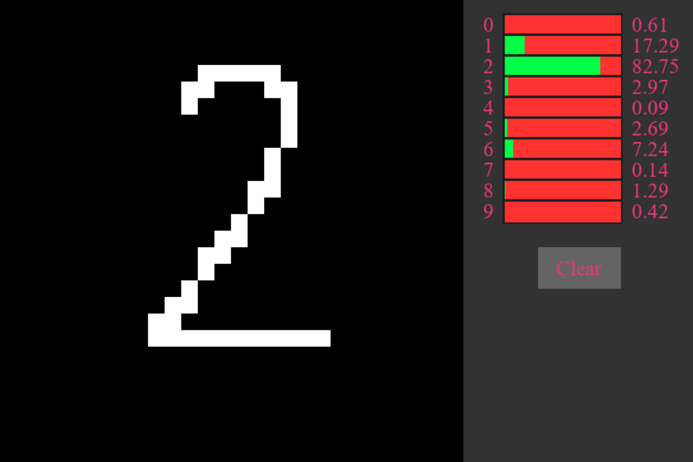

# Digits
Application just for fun. You can draw any digit and Neural network will try to recognize it.

## Setup
First you need to create virtual environment with command `python -m venv venv_name`.

Then activate your venv and install requirements with command `pip install -r requirements.txt`.

## Run
Print in terminal:
- `python main.py perceptron` - to run perceptron model.
- `python main.py lenet` - to run LeNet model.

